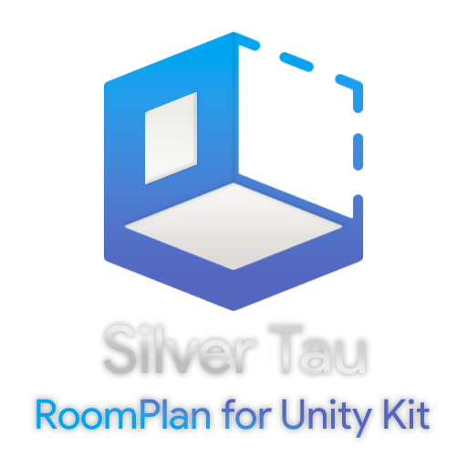

# RoomPlan Unity Kit [1.3.7]

The RoomPlan for Unity Kit provides the ability to create a 3D model of an interior room by guiding the user to scan their physical environment using the device's camera and creates a bridge to interact with Apple RoomPlan API in the Unity Engine.

**The main features of this API include:**

**AR Foundation support:** RoomPlan for Unity Kit is fully compatible with ARFoundation and is ready to use and interact with all available features in Unity (iOS 17+). 

**Creating a 3D room model:** RoomPlan for Unity Kit allows you to create a 3D model of an interior room using device sensors, trained machine learning models, and Unity's rendering capabilities.

**Detection of physical structures:** The RoomPlan API analyzes camera video feeds and LiDAR data to identify walls, windows, doors, and other physical structures in a room.

**Detection of furniture and appliances:** RoomPlan recognizes room features, furniture, and appliances such as a fireplace, bed, or refrigerator and provides this information to the app.

**Displaying AR tips:** Users are shown virtual on-screen guidance during scanning that indicates the direction and progress of the scan.

**Processing of scan results:** Scan results are displayed in a parametric data format, allowing the application to modify individual components of the scanned room.

**Exporting a 3D model:** After combining the scans into a single structure, you can export a 3D model that includes all the rooms captured in that physical area.

**Merge scans:** You can combine the scans of several rooms into a single structure (CapturedStructure). This allows you to create a model file and analyze specific shapes, sizes, or objects that RoomPlan observes in the structure.

**Support for rooms with different floors and surfaces:** Scanned structures support rooms with different floor heights and rooms on different floors in a building.

**Import/Export 3D model (.obj):** Using the utilities developed and built into the plugin, you can easily import Unity models into both the Runtime and Editor.

**The main modes of operation that are created for you:**

**Default mode:**
The default mode is the augmented reality mode introduced by Apple in its RoomPlan solution. This mode is implemented in Unity. It is also possible to change the settings of this mode in the "RoomPlan Unity Kit Settings".

**Custom mode:**
Custom mode is an augmented reality mode that allows you to fully customize scanning to your needs and interact with scanned objects in the Unity environment. It is also possible to change the settings of this mode in the "RoomPlan Unity Kit Settings".

**Your mode:**
Let your imagination run wild, build captivating environments, and create memories that will mesmerize users.

Everything is in your hands. Imagine, create and enjoy!

Need help or want to know more?
[Page](https://www.silvertau.com/products/roomplan-for-unity-kit) | [Documentation](https://silvertau.s3.eu-central-1.amazonaws.com/RoomPlanForUnityKit/Documentation/index.html)

**Features:**
- An independent solution with its own interaction with ARKit;
- ARFoundation support;
- OBJ utility;
- CSGeometry utility;
- QuickLook utility;
- Screen Recorder utility;
- Screenshot utility;
- Share utility;
- Constructive solid geometry for RoomBuilder;
- USD export settings;
- MultiRoom support;
- Merging multiple scans;
- Structure Builder;
- Captured Structure;
- Floor creator (AR & RoomBuilder);
- Shadow receiver shader (AR & RoomBuilder);
- Visualization a model in a room;
- AR Raycast plans;
- Flashlight feature;
- Automatic flashlight in AR feature;
- Pause/Resume RoomPlan Capture Session scanning;
- Implementation of the standard module;
- Full ability to work in the Unity engine;
- Full customization;
- The ability to take a screenshot;
- The ability to record video from the screen;
- Saving scanned objects;
- The ability to work in the Unity engine editor;
and much more!